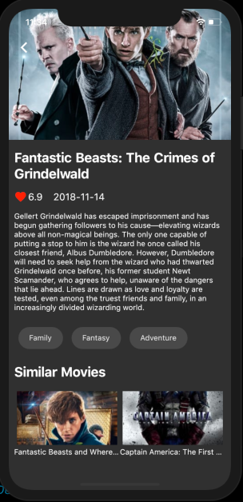

# Fluttery Movies

Movies app 🎥 which is developed using Flutter and powered by tmdb api. It follows bloc architecture pattern and Inherited Widget.
This project was made for learning the bloc architecture pattern and Inherited Widget. 


# Screenshot

| Movie List Screen | Movie Detail Screen |
| ------------------ | ------------------ |
|   |   |

 
## Questions?🤔

Hit me on twitter [](https://twitter.com/mohak_gupta20)
[](https://www.linkedin.com/in/mohak-gupta-885669131/)

## How to Contribute
1. Fork the the project
2. Create your feature branch (git checkout -b my-new-feature)
3. Make required changes and commit (git commit -am 'Add some feature')
4. Push to the branch (git push origin my-new-feature)
5. Create new Pull Request

## Getting Started

For help getting started with Flutter, view online
[documentation](https://flutter.dev/).

#### 1. [Setup Flutter](https://flutter.dev/setup/)

#### 2. Clone the repo

```sh
$ git clone https://github.com/mohak1283/Flutter-Movies.git
$ cd Fluttery-Movies/
```

#### 4. Run the app

```sh
$ flutter run
```

## License
Copyright 2018 Mohak Gupta

Licensed under the Apache License, Version 2.0 (the "License"); you may not use this file except in compliance with the License. You may obtain a copy of the License at

http://www.apache.org/licenses/LICENSE-2.0

Unless required by applicable law or agreed to in writing, software distributed under the License is distributed on an "AS IS" BASIS, WITHOUT WARRANTIES OR CONDITIONS OF ANY KIND, either express or implied. See the License for the specific language governing permissions and limitations under the License.

